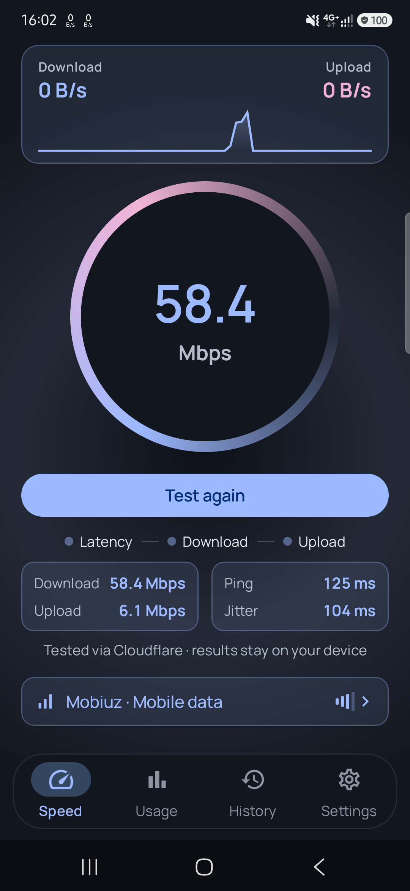
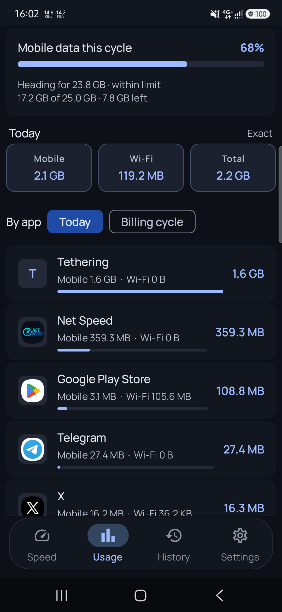
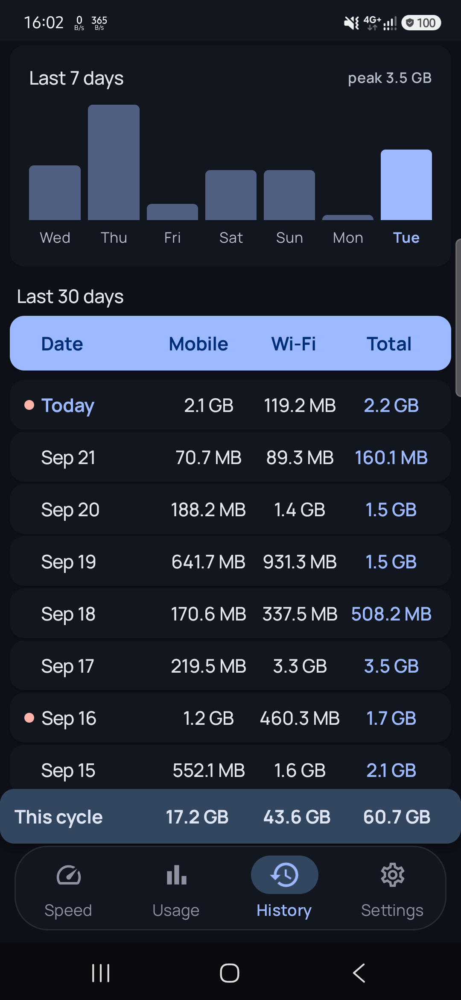
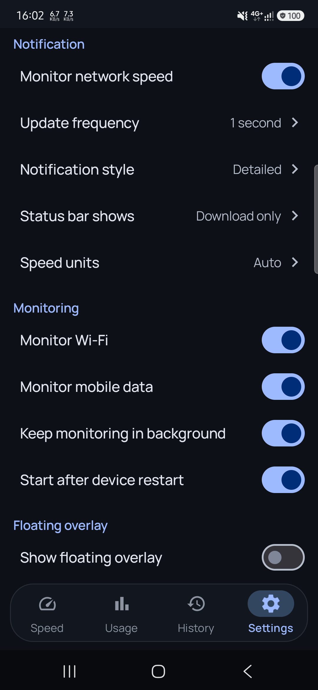

# Net Speed 📱

Real-time internet speed monitoring with a persistent notification, a floating overlay, per-app
data breakdowns and a built-in speed test. Everything is measured and stored on your device.

---

*Coming soon to Google Play.*

<!-- Restore once the listing is live:

-->

---

## 🚀 Features

### Live speed
- **Status bar readout** — current speed rendered into the notification icon, so it is visible
  without pulling down the shade
- **Display modes** — download only, upload only, both directions, or a combined total. The choice
  drives the notification, the status bar icon, the floating overlay and the home screen together
- **Units** — Auto, Mbps, Kbps, MB/s or KB/s. Bit and byte units are genuinely converted, not
  relabelled
- **Live sparkline** of the last minute on the Speed screen
- **Connection details** — tap the network row for link speed, band, signal, IP and DNS, using
  only permissions that need no prompt

### Data usage
- **Per-app breakdown** — which apps used what, for today or the whole billing cycle
- **Foreground vs background split** per app, so you can see what an app moved while you were not
  using it
- **System-accurate totals** — read from Android's own accounting via `NetworkStatsManager`, so
  figures match Settings rather than being re-derived from sampling
- **Dual-SIM aware** — mobile usage is summed across subscribers
- **History** — 30-day table plus a weekly chart; tap any day for its totals and top apps
- **Data limit alerts** — set a mobile cap and a warning threshold, on your own billing cycle day.
  Each level notifies once per cycle
- **Usage forecast** — projects the cycle from the rate so far, so you know before you go over
- **Per-app limits** — an allowance for any single app, warned once per cycle
- **Roaming and background-data warnings** — the first the moment roaming starts, the second when
  an app moves a lot of data while you are not in it
- **Limit indicators** on history rows, amber at the threshold and red past the day's share

### Surfaces
- **Floating overlay** — draggable, always on top, showing speed plus latency and session total.
  Size, colour and background opacity are configurable; tap to open the app
- **Speed test** — download, upload, ping and jitter, run inline on the Speed screen
- **Two home screen widgets** — live speed, and data usage against your limit — plus a
  **Quick Settings tile** to toggle monitoring

### Behaviour
- **Foreground service** that survives the app being closed or swiped away
- **Auto-start after reboot** (optional), only if monitoring was running beforehand
- **Screen-off throttling** — sampling and redraws slow while the screen is off. Byte accounting is
  unaffected, since the counters are cumulative
- **Material You** dynamic colour on Android 12+, plus dark and light themes

## ✦ Screenshots

| Speed + test | Per-app usage | History | Settings |
|:---:|:---:|:---:|:---:|
|  |  |  |  |
| Live speed, and a finished speed test | Which apps used what, with the cycle forecast | 30 days, with over-limit days flagged | Everything configurable |

Store-ready versions with captions are in
[`samples/play_store_screenshots/`](samples/play_store_screenshots), generated from the raw
captures by [`samples/make_play_screenshots.py`](samples/make_play_screenshots.py) — re-run it
after replacing the captures to rebuild them.

---

## 🛠️ Tech Stack

- **Kotlin** + **Jetpack Compose**, Material 3
- **MVVM** with **Koin** for dependency injection
- **Room** for usage history (schema v4, with real migrations)
- **DataStore** for preferences
- **Foreground Service** for monitoring, **WindowManager** for the overlay
- **NetworkStatsManager** for accurate and per-app usage; **TrafficStats** for live speed
- **AppWidgetProvider** and **TileService** for the widget and tile
- minSdk 26 · targetSdk 35

## 🔑 Permissions

Granted automatically at install:

| Permission | Why |
|---|---|
| `INTERNET`, `ACCESS_NETWORK_STATE`, `ACCESS_WIFI_STATE` | Measure speed, read connection state |
| `FOREGROUND_SERVICE`, `FOREGROUND_SERVICE_SPECIAL_USE` | Keep monitoring while closed. `specialUse` because Android 15 caps `dataSync` at ~6h/day |
| `RECEIVE_BOOT_COMPLETED` | Resume monitoring after a restart |
| `WAKE_LOCK` | Keep sampling while the screen is off |

Asked for at runtime:

| Permission | Why |
|---|---|
| `POST_NOTIFICATIONS` (Android 13+) | Show the speed notification and limit alerts |
| `READ_PHONE_STATE` | Mobile signal strength. Declined simply hides it |

Granted by the user in system settings — the app cannot request these directly:

| Permission | Unlocks |
|---|---|
| **Usage access** (`PACKAGE_USAGE_STATS`) | Per-app usage and system-accurate totals |
| **Draw over other apps** (`SYSTEM_ALERT_WINDOW`) | The floating overlay |
| Battery optimisation exemption | Prevents aggressive OEM battery managers stopping the service |

Without usage access the app still works, falling back to sampled figures — the Usage screen says
which mode it is in.

## 📱 Usage

1. Open the app; monitoring starts and the speed appears in your status bar
2. Grant **usage access** when prompted on the Usage tab for exact figures and per-app data
3. **Speed** — live speed, sparkline, ping and connection details
4. **Usage** — today's totals, your data cap, and the per-app breakdown
5. **History** — 30 days of daily usage; tap a day to see what used it
6. **Settings** — notification style and units, data limit and alerts, overlay, theme

A full privacy policy is at [`docs/privacy-policy.html`](docs/privacy-policy.html).

## 🔒 Privacy

- **Usage and speed data stay on your device.** Nothing is uploaded, and there is no analytics or
  crash reporting
- **No ads, no tracking**
- **One exception:** the built-in speed test measures against Cloudflare's public endpoint
  (`speed.cloudflare.com`). No information about you is sent — the endpoints simply return or
  discard a number of bytes — but the request necessarily reveals your IP address to Cloudflare,
  as any speed test must. The test only runs when you start it, and its results are stored locally
- App names and icons in the per-app breakdown are read from your device's package manager, never
  from a network service

---

## 🏷️ Play Store listing

Copy for the Play Console. Both are kept here so the listing and the app can be revised together.

### Short description

> Speed meter in your status bar, per-app data usage. No ads, no tracking.

### Full description

> **Net Speed shows how fast your connection is and where your data goes — without ads, without
> tracking, and without sending anything anywhere.**
>
> Your current download and upload speed sits in the status bar and the notification shade, always
> visible, updating live. Open the app to see which apps used your data, how much of your monthly
> allowance is left, and whether you are on course to go over it.
>
> **LIVE SPEED**
> • Real-time download and upload speed in the status bar
> • Choose what to show: download, upload, both, or a combined total
> • Units in Mbps, Kbps, MB/s, KB/s, or automatic
> • Compact or detailed notification
> • Optional floating overlay you can drag anywhere — with live latency, useful while gaming or
>   on a call
>
> **DATA USAGE**
> • See exactly which apps used your data, split by mobile and Wi-Fi
> • Foreground and background usage per app — find what is using data when you are not looking
> • Figures read from Android's own accounting, so totals match your device Settings
> • 30 days of daily history, with a weekly chart
> • Tap any day to see which apps were responsible
>
> **STAY UNDER YOUR LIMIT**
> • Set your mobile data limit and your real billing cycle day
> • Get warned before you reach it, at a threshold you choose
> • A forecast tells you where the cycle is heading at your current rate
> • Set limits for individual apps
> • Warnings for roaming and for heavy background data
>
> **SPEED TEST**
> • Download, upload, ping and jitter
> • Clear gauge, no countdown ads, no daily limit
>
> **ON YOUR HOME SCREEN**
> • Live speed widget
> • Data usage widget with your limit progress
> • Quick Settings tile to start and stop monitoring
>
> **DESIGNED FOR ANDROID**
> • Material You — follows your wallpaper colours on Android 12 and above
> • Dark and light themes
> • Runs in the background and restarts after a reboot
> • Light on battery: sampling slows while the screen is off
>
> **ABOUT PERMISSIONS**
> Two permissions are optional and you grant them yourself in system settings:
>
> • **Usage access** unlocks per-app usage and makes totals exact. It is only used to read network
>   statistics — never to see which apps you open or for how long.
> • **Display over other apps** draws the floating overlay. The overlay only draws text; it cannot
>   see or touch what is beneath it.
>
> The app works without either one.
>
> **PRIVACY**
> Net Speed has no ads, no analytics, no crash reporting and no accounts. Your usage data is
> stored on your device and is never uploaded. The only time the app contacts an outside server
> is when you press Start on the speed test, which transfers meaningless bytes to Cloudflare's
> public endpoint to measure throughput — nothing about you is included.
>
> Uninstalling deletes everything.

### Release notes

Play allows 500 characters per language. First release:

> First release.
>
> • Live download and upload speed in your status bar
> • See which apps use your data, including in the background
> • Set a data limit and get warned before you reach it
> • Usage forecast tells you where your cycle is heading
> • 30 days of history, per-app and per-day
> • Built-in speed test, floating overlay, home screen widgets
>
> No ads, no tracking. Everything stays on your device.

### Suggested search keywords

`internet speed meter` · `data usage monitor` · `net speed indicator` · `data usage manager`
· `internet speed test` · `network monitor` · `mobile data usage` · `speed meter`
